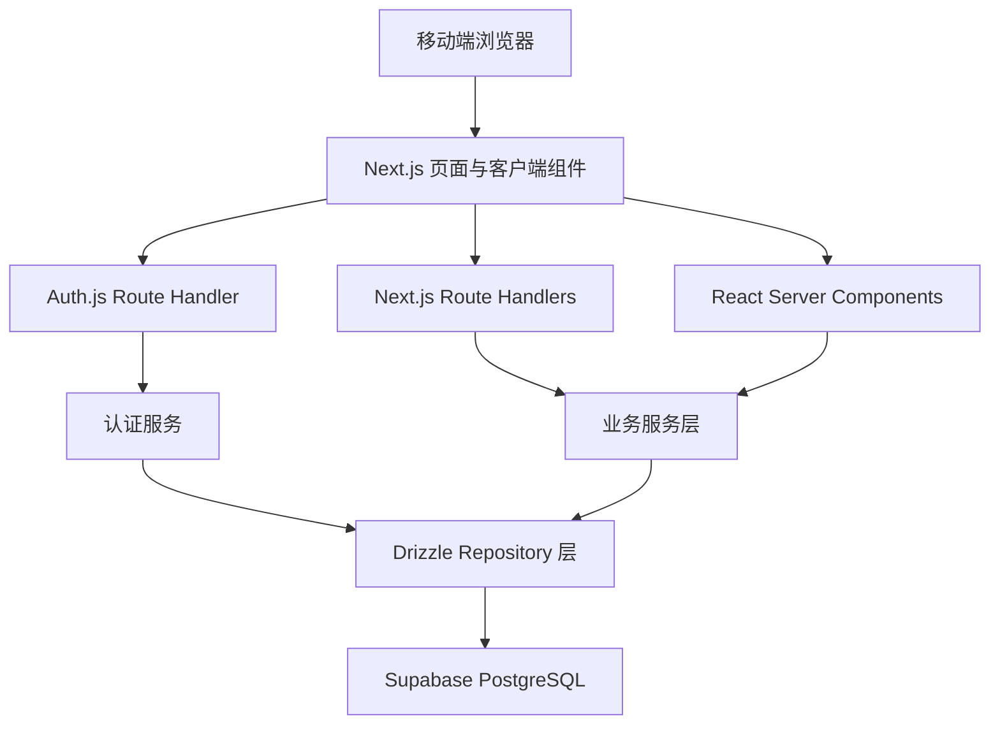
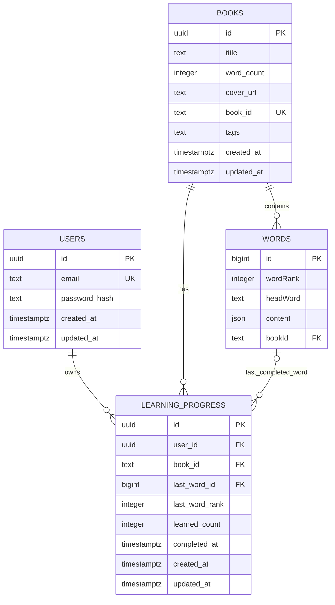
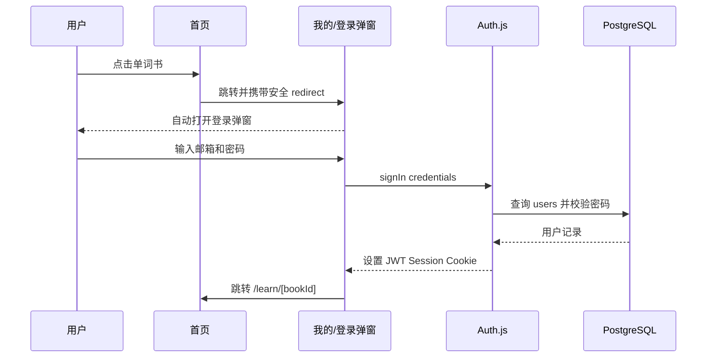
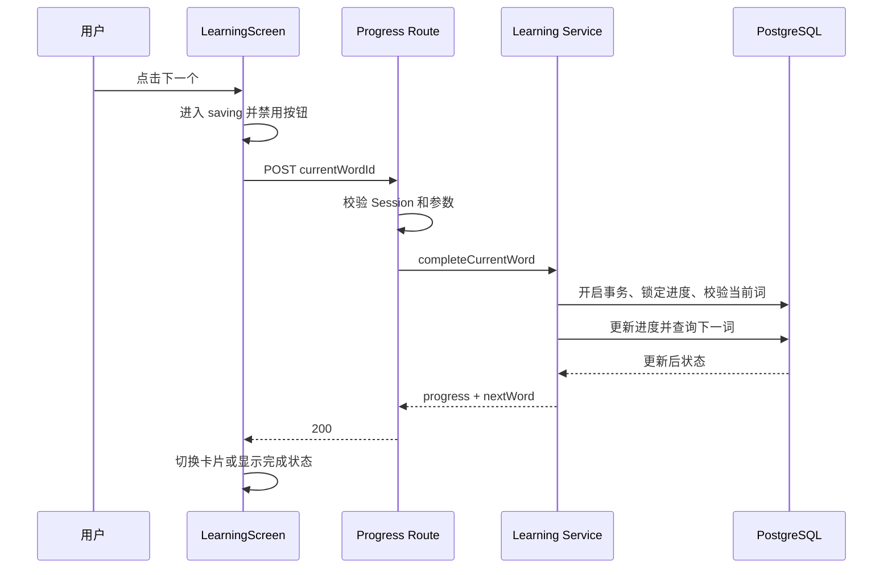

# H5 英语单词学习项目技术设计文档

## 1. 文档信息

| 项目 | 内容 |
| --- | --- |
| 项目名称 | H5 英语单词学习项目 |
| 文档类型 | 前后端技术设计文档 |
| 文档版本 | v1.0 |
| 需求依据 | `proposal.md` |
| 目标项目 | `nextjs-typescript-starter` |
| 数据库 | Supabase PostgreSQL |
| ORM | Drizzle ORM |
| 认证方案 | Auth.js / NextAuth Credentials + JWT Cookie |

本文档描述 `proposal.md` 中 H5 英语单词学习功能的技术实现方案，覆盖数据库、认证、服务端接口、前端页面、核心学习流程、安全、测试和部署。

## 2. 设计目标

1. 在不破坏现有 `books`、`words` 数据的前提下增加用户和学习进度能力。
2. 复用项目已有邮箱、密码、`bcrypt-ts` 和 Auth.js 登录逻辑。
3. 保证每个用户在每本单词书中只有一条进度记录。
4. 用户点击“下一个”时，进度保存与下一词计算必须一致、可重试且防止重复累计。
5. 首页只获取轻量单词书信息，不加载完整单词 JSON。
6. 所有用户身份和数据权限判断均在服务端完成。
7. 数据库变更由 Drizzle Schema 和迁移管理，不在请求过程中动态建表。
8. 页面优先适配 320px～480px 的移动端 H5。

## 3. 当前状态与需要调整的地方

### 3.1 已有能力

- Next.js 14 App Router。
- React 18、TypeScript、Tailwind CSS。
- Auth.js / NextAuth Credentials 登录入口。
- `bcrypt-ts` 密码哈希和校验。
- Drizzle ORM 与 `postgres.js`。
- Supabase PostgreSQL 中已有 `books`、`words` 两张业务表。

### 3.2 当前实现问题

当前 `app/db.ts` 会在请求时执行 `ensureTableExists()` 并动态创建区分大小写的 `"User"` 表。该做法需要替换，原因如下：

- 用户明确说明当前数据库只有 `books` 和 `words`，不能假设已有 `"User"`。
- 请求时建表会增加延迟，并可能在并发、权限和部署环境中失败。
- `"User"` 使用 `serial`、可空邮箱和可空密码，约束不足。
- 数据库结构不受正式迁移记录管理。

当前 `app/auth.config.ts` 还会把所有已登录用户从普通页面重定向到 `/protected`。H5 实现后必须移除该全局重定向，否则已登录用户无法访问首页 `/` 和“我的” `/me`。

### 3.3 本设计对需求文档的校正

`proposal.md` 中“已有 User 表”是基于 starter 代码作出的初步假设。根据本次确认的数据库实际状态，本设计以以下事实为准：

- 已有表：`books`、`words`。
- 新增表：`users`、`learning_progress`。
- 不复用管理后台的 `admin-users`；H5 学习用户和后台管理员是两类不同身份。

## 4. 技术栈与依赖

| 层级 | 技术 | 用途 |
| --- | --- | --- |
| 框架 | Next.js 14 App Router | 页面、Route Handler、服务端渲染 |
| UI | React 18 + Tailwind CSS 3 | H5 页面与交互 |
| 语言 | TypeScript strict mode | 类型约束 |
| 认证 | Auth.js / NextAuth v5 beta | Credentials 登录、JWT Session |
| 密码 | `bcrypt-ts` | 密码哈希和比对 |
| ORM | Drizzle ORM | 类型安全查询与事务 |
| 数据库驱动 | `postgres.js` | 连接 Supabase PostgreSQL |
| 数据库 | Supabase PostgreSQL | 词书、单词、用户和进度 |
| 校验 | 建议增加 `zod` | 表单、接口参数、数据库 JSON 边界校验 |
| 迁移 | 建议增加 `drizzle-kit` | 生成和执行迁移 |

建议补充的依赖：

```bash
npm install zod
npm install -D drizzle-kit
```

对应脚本建议：

```json
{
  "scripts": {
    "db:generate": "drizzle-kit generate",
    "db:migrate": "drizzle-kit migrate",
    "db:studio": "drizzle-kit studio"
  }
}
```

## 5. 总体架构



职责边界：

- 页面组件负责布局、状态展示和交互触发。
- Route Handler 负责解析请求、校验参数、身份校验和响应格式。
- Service 负责学习规则、事务和权限规则。
- Repository 只负责 Drizzle 数据访问，不包含页面逻辑。
- 所有数据库连接只存在于服务端模块，浏览器不直接连接数据库。

## 6. 推荐目录结构

```text
nextjs-typescript-starter/
├── app/
│   ├── (tabs)/
│   │   ├── layout.tsx                 # 带底部 Tab 的 H5 布局
│   │   ├── page.tsx                   # 首页 /
│   │   └── me/
│   │       └── page.tsx               # 我的 /me
│   ├── learn/
│   │   └── [bookId]/
│   │       └── page.tsx               # 单词学习页
│   ├── words/
│   │   └── [wordId]/
│   │       └── page.tsx               # 单词详情页
│   ├── api/
│   │   ├── auth/
│   │   │   ├── [...nextauth]/route.ts
│   │   │   └── register/route.ts
│   │   ├── books/route.ts
│   │   ├── books/[bookId]/next/route.ts
│   │   ├── books/[bookId]/progress/route.ts
│   │   ├── me/progress/route.ts
│   │   ├── me/recent/route.ts
│   │   └── words/[wordId]/route.ts
│   ├── auth.ts
│   ├── auth.config.ts
│   ├── globals.css
│   └── layout.tsx
├── components/
│   ├── auth/auth-dialog.tsx
│   ├── auth/login-form.tsx
│   ├── auth/register-form.tsx
│   ├── books/book-card.tsx
│   ├── books/book-list.tsx
│   ├── learning/word-card.tsx
│   ├── learning/learning-screen.tsx
│   ├── learning/progress-bar.tsx
│   ├── layout/bottom-tabs.tsx
│   └── words/word-detail.tsx
├── db/
│   ├── index.ts                     # 数据库客户端，仅服务端导入
│   ├── schema.ts                    # Drizzle 表与 relations
│   └── migrations/
├── lib/
│   ├── auth/
│   │   ├── password.ts
│   │   ├── session.ts
│   │   └── validation.ts
│   ├── repositories/
│   │   ├── books.repository.ts
│   │   ├── users.repository.ts
│   │   ├── words.repository.ts
│   │   └── progress.repository.ts
│   ├── services/
│   │   ├── auth.service.ts
│   │   └── learning.service.ts
│   ├── dto/
│   │   ├── book.dto.ts
│   │   ├── progress.dto.ts
│   │   └── word.dto.ts
│   ├── word-content.ts
│   ├── api-response.ts
│   └── safe-redirect.ts
├── types/
│   └── next-auth.d.ts
├── drizzle.config.ts
├── proposal.md
└── design.md
```

说明：目录可以按开发过程渐进建立，但数据库、认证和业务逻辑不应继续全部放在 `app/db.ts` 中。

## 7. 数据库设计

### 7.1 已有 `books` 表

数据库中的现有定义如下，本期不重建该表：

```sql
create table public.books (
  id uuid not null default gen_random_uuid (),
  title text not null,
  word_count integer not null default 0,
  cover_url text null,
  book_id text not null,
  tags text null,
  created_at timestamp with time zone not null default now(),
  updated_at timestamp with time zone not null default now(),
  constraint books_pkey primary key (id),
  constraint books_book_id_unique unique (book_id)
) TABLESPACE pg_default;
```

字段说明：

| 数据库字段 | TypeScript 字段 | 说明 |
| --- | --- | --- |
| `id` | `id` | UUID 数据库主键 |
| `title` | `title` | 单词书标题 |
| `word_count` | `wordCount` | 后台维护的单词数缓存 |
| `cover_url` | `coverUrl` | 封面 URL，可空 |
| `book_id` | `bookId` | 业务 ID，用于关联 `words` |
| `tags` | `tags` | 逗号分隔的标签文本 |
| `created_at` | `createdAt` | 创建时间 |
| `updated_at` | `updatedAt` | 更新时间 |

注意：`tags` 当前是 `text`，不是 PostgreSQL `text[]`。前端 DTO 层需要按英文逗号切分、去除空格和空项，不修改数据库原始类型。

### 7.2 已有 `words` 表

根据现有数据库定义，单词表目标映射如下：

```sql
create table public.words (
  id bigint generated by default as identity not null,
  "wordRank" integer null,
  "headWord" text null,
  content json null,
  "bookId" text null,
  constraint words_pkey primary key (id)
) TABLESPACE pg_default;
```

| 数据库字段 | TypeScript 字段 | 说明 |
| --- | --- | --- |
| `id` | `id` | 单词主键，API 中序列化为字符串 |
| `wordRank` | `wordRank` | 单词在词书内的学习顺序 |
| `headWord` | `headWord` | 单词标题 |
| `content` | `content` | 完整单词 JSON |
| `bookId` | `bookId` | 关联 `books.book_id` |

#### 关系和索引目标状态

为了稳定实现按 `bookId` 顺序学习，需要确认数据库存在以下外键和索引。若当前不存在，应通过一次迁移补充，而不是重建表：

```sql
alter table public.words
  add constraint words_book_id_books_book_id_fk
  foreign key ("bookId")
  references public.books (book_id)
  on delete cascade
  on update cascade;

create index if not exists words_book_id_idx
  on public.words ("bookId");

create unique index if not exists words_book_rank_unique_idx
  on public.words ("bookId", "wordRank")
  where "bookId" is not null and "wordRank" is not null;
```

执行唯一索引迁移前，必须先检查是否存在重复排序值：

```sql
select "bookId", "wordRank", count(*)
from public.words
where "bookId" is not null and "wordRank" is not null
group by "bookId", "wordRank"
having count(*) > 1;
```

如查询有结果，应先修复重复数据。`wordRank` 或 `bookId` 为空的记录不进入学习序列，但仍允许保留在数据库中用于数据排查。

### 7.3 新增 `users` 表

H5 学习用户单独保存到 `users`，不与管理后台管理员表混用。

```sql
create table public.users (
  id uuid not null default gen_random_uuid(),
  email text not null,
  password_hash text not null,
  created_at timestamp with time zone not null default now(),
  updated_at timestamp with time zone not null default now(),
  constraint users_pkey primary key (id),
  constraint users_email_unique unique (email),
  constraint users_email_normalized_check
    check (email = lower(btrim(email)))
);
```

| 字段 | 说明 |
| --- | --- |
| `id` | 用户 UUID，同时写入 Auth.js JWT 的 `userId` |
| `email` | 归一化后的邮箱，非空且唯一 |
| `password_hash` | bcrypt 哈希，只在服务端读取 |
| `created_at` | 注册时间 |
| `updated_at` | 用户信息更新时间，由应用写入时显式更新 |

设计要求：

- 注册前执行 `email.trim().toLowerCase()`。
- 密码只保存哈希，不保存原文或可逆加密结果。
- API 和页面 DTO 永远不返回 `password_hash`。
- 唯一约束是防止并发重复注册的最终保障，不能只依赖“先查询再插入”。

### 7.4 新增 `learning_progress` 表

本期学习方式是按词书顺序线性推进，不包含收藏、错词、掌握度和多轮复习，因此一本词书只需要一条书级进度记录。

```sql
create table public.learning_progress (
  id uuid not null default gen_random_uuid(),
  user_id uuid not null,
  book_id text not null,
  last_word_id bigint null,
  last_word_rank integer null,
  learned_count integer not null default 0,
  completed_at timestamp with time zone null,
  created_at timestamp with time zone not null default now(),
  updated_at timestamp with time zone not null default now(),
  constraint learning_progress_pkey primary key (id),
  constraint learning_progress_user_book_unique unique (user_id, book_id),
  constraint learning_progress_learned_count_check check (learned_count >= 0),
  constraint learning_progress_last_word_rank_check
    check (last_word_rank is null or last_word_rank >= 0),
  constraint learning_progress_user_id_users_id_fk
    foreign key (user_id)
    references public.users (id)
    on delete cascade,
  constraint learning_progress_book_id_books_book_id_fk
    foreign key (book_id)
    references public.books (book_id)
    on delete cascade
    on update cascade,
  constraint learning_progress_last_word_id_words_id_fk
    foreign key (last_word_id)
    references public.words (id)
    on delete set null
);

create index learning_progress_user_updated_idx
  on public.learning_progress (user_id, updated_at desc);

create index learning_progress_book_idx
  on public.learning_progress (book_id);
```

字段语义：

| 字段 | 说明 |
| --- | --- |
| `user_id` | 进度所属用户 |
| `book_id` | 进度所属词书业务 ID |
| `last_word_id` | 最近一次成功点击“下一个”的单词 ID |
| `last_word_rank` | 最近完成词的排序游标，用于寻找下一词 |
| `learned_count` | 当前轮次已完成的单词数量 |
| `completed_at` | 完成最后一词的时间，未完成时为空 |
| `updated_at` | 最近学习时间，用于首页“最近学习”排序 |

服务层必须保证 `last_word_id` 对应的单词属于同一个 `book_id`。普通外键只能保证单词存在，无法独立保证跨列业务一致性，因此该规则需在同一数据库事务中校验。

#### 为什么本期不新增逐词进度表

`proposal.md` 的本期范围只要求顺序学习、继续上次位置和展示完成数量。`learning_progress` 已足够满足这些要求。

当未来需要以下功能时，再新增 `user_word_progress`：

- 单词掌握/不认识状态。
- 错词本和收藏。
- 一个单词多轮复习记录。
- 间隔重复算法。
- 每日学习统计和历史回放。

本期提前创建逐词记录会造成大量无实际用途的行和更复杂的写入逻辑，因此不创建。

#### 为什么本期不新增 Session 表

现有项目使用 Auth.js Credentials，默认适合采用加密签名的 JWT Cookie。Session 中只保存用户 ID、邮箱和过期时间，不保存密码。因此本期无需数据库 Session 表。

如果未来需要后台强制下线单个设备、多设备会话管理或即时撤销令牌，再切换为数据库 Session 策略并设计会话表。

### 7.5 实体关系图



### 7.6 Drizzle Schema 目标定义

以下代码展示数据库字段与 TypeScript 字段的目标映射。`books`、`words` 是已有表映射；迁移只应新增缺失结构。

```ts
import { relations, sql } from 'drizzle-orm';
import {
  bigint,
  check,
  index,
  integer,
  json,
  pgTable,
  text,
  timestamp,
  unique,
  uniqueIndex,
  uuid,
} from 'drizzle-orm/pg-core';

import type { WordContent } from '@/lib/word-content';

export const books = pgTable('books', {
  id: uuid('id').defaultRandom().primaryKey(),
  title: text('title').notNull(),
  wordCount: integer('word_count').notNull().default(0),
  coverUrl: text('cover_url'),
  bookId: text('book_id').notNull().unique('books_book_id_unique'),
  tags: text('tags'),
  createdAt: timestamp('created_at', { withTimezone: true, mode: 'date' })
    .notNull()
    .defaultNow(),
  updatedAt: timestamp('updated_at', { withTimezone: true, mode: 'date' })
    .notNull()
    .defaultNow(),
});

export const words = pgTable(
  'words',
  {
    id: bigint('id', { mode: 'bigint' })
      .primaryKey()
      .generatedByDefaultAsIdentity(),
    wordRank: integer('wordRank'),
    headWord: text('headWord'),
    content: json('content').$type<WordContent>(),
    bookId: text('bookId').references(() => books.bookId, {
      onDelete: 'cascade',
      onUpdate: 'cascade',
    }),
  },
  (table) => [
    index('words_book_id_idx').on(table.bookId),
    uniqueIndex('words_book_rank_unique_idx')
      .on(table.bookId, table.wordRank)
      .where(sql`${table.bookId} is not null and ${table.wordRank} is not null`),
  ],
);

export const users = pgTable(
  'users',
  {
    id: uuid('id').defaultRandom().primaryKey(),
    email: text('email').notNull(),
    passwordHash: text('password_hash').notNull(),
    createdAt: timestamp('created_at', { withTimezone: true, mode: 'date' })
      .notNull()
      .defaultNow(),
    updatedAt: timestamp('updated_at', { withTimezone: true, mode: 'date' })
      .notNull()
      .defaultNow(),
  },
  (table) => [
    uniqueIndex('users_email_unique').on(table.email),
    check('users_email_normalized_check', sql`${table.email} = lower(btrim(${table.email}))`),
  ],
);

export const learningProgress = pgTable(
  'learning_progress',
  {
    id: uuid('id').defaultRandom().primaryKey(),
    userId: uuid('user_id')
      .notNull()
      .references(() => users.id, { onDelete: 'cascade' }),
    bookId: text('book_id')
      .notNull()
      .references(() => books.bookId, {
        onDelete: 'cascade',
        onUpdate: 'cascade',
      }),
    lastWordId: bigint('last_word_id', { mode: 'bigint' }).references(
      () => words.id,
      { onDelete: 'set null' },
    ),
    lastWordRank: integer('last_word_rank'),
    learnedCount: integer('learned_count').notNull().default(0),
    completedAt: timestamp('completed_at', {
      withTimezone: true,
      mode: 'date',
    }),
    createdAt: timestamp('created_at', { withTimezone: true, mode: 'date' })
      .notNull()
      .defaultNow(),
    updatedAt: timestamp('updated_at', { withTimezone: true, mode: 'date' })
      .notNull()
      .defaultNow(),
  },
  (table) => [
    unique('learning_progress_user_book_unique').on(
      table.userId,
      table.bookId,
    ),
    index('learning_progress_user_updated_idx').on(
      table.userId,
      table.updatedAt,
    ),
    index('learning_progress_book_idx').on(table.bookId),
    check(
      'learning_progress_learned_count_check',
      sql`${table.learnedCount} >= 0`,
    ),
    check(
      'learning_progress_last_word_rank_check',
      sql`${table.lastWordRank} is null or ${table.lastWordRank} >= 0`,
    ),
  ],
);

export const booksRelations = relations(books, ({ many }) => ({
  words: many(words),
  progress: many(learningProgress),
}));

export const usersRelations = relations(users, ({ many }) => ({
  progress: many(learningProgress),
}));

export const wordsRelations = relations(words, ({ one, many }) => ({
  book: one(books, {
    fields: [words.bookId],
    references: [books.bookId],
  }),
  lastProgress: many(learningProgress),
}));

export const learningProgressRelations = relations(
  learningProgress,
  ({ one }) => ({
    user: one(users, {
      fields: [learningProgress.userId],
      references: [users.id],
    }),
    book: one(books, {
      fields: [learningProgress.bookId],
      references: [books.bookId],
    }),
    lastWord: one(words, {
      fields: [learningProgress.lastWordId],
      references: [words.id],
    }),
  }),
);
```

注意：不同 Drizzle 版本在复合索引回调语法上可能略有差异，落地时应以项目实际安装版本生成的迁移为准，并检查 SQL 与本节目标结构一致。

### 7.7 数据库连接设计

数据库模块必须标记为仅服务端使用：

```ts
import 'server-only';
import { drizzle } from 'drizzle-orm/postgres-js';
import postgres from 'postgres';

const databaseUrl = process.env.DATABASE_URL;

if (!databaseUrl) {
  throw new Error('DATABASE_URL is not configured');
}

const client = postgres(databaseUrl, {
  prepare: false,
  max: process.env.NODE_ENV === 'production' ? 5 : 1,
});

export const db = drizzle(client);
```

说明：

- Supabase Transaction Pooler 通常要求关闭 prepared statements，因此使用 `prepare: false`。
- 不要在代码中手工把 `?sslmode=require` 拼接到 URL 尾部，避免原 URL 已含查询参数时产生无效连接串。
- `DATABASE_URL` 只能存在于服务端环境变量，不能使用 `NEXT_PUBLIC_` 前缀。
- 开发环境可使用 `globalThis` 缓存客户端，减少热更新造成的连接数量。

### 7.8 迁移策略

#### 迁移原则

1. `books`、`words` 已存在，不生成会删除或重建它们的迁移。
2. 先把现有表准确映射进 Drizzle Schema，再新增 `users`、`learning_progress`。
3. 迁移 SQL 必须人工检查后执行。
4. 正式环境禁止直接使用 `drizzle-kit push` 修改结构。
5. 不在 Next.js 页面请求或 Vercel Build 阶段自动执行迁移。

#### 推荐顺序

1. 从 Supabase 导出或备份当前数据库结构和数据。
2. 检查 `words.bookId` 是否存在无对应 `books.book_id` 的孤儿数据。
3. 检查同一词书是否存在重复 `wordRank`。
4. 定义现有 `books`、`words` 的 Drizzle 映射。
5. 生成只包含新增表、外键和索引的迁移。
6. 审查迁移，确保不存在 `DROP TABLE books`、`DROP TABLE words` 或列类型误改。
7. 先在开发数据库执行，再验证注册和学习流程。
8. 最后在生产数据库执行同一份迁移。

孤儿数据检查：

```sql
select w.id, w."bookId"
from public.words w
left join public.books b on b.book_id = w."bookId"
where w."bookId" is not null and b.id is null;
```

## 8. 认证与会话设计

### 8.1 注册流程

注册入口使用 `POST /api/auth/register`，流程如下：

1. 接收邮箱和密码。
2. 对邮箱执行 `trim().toLowerCase()`。
3. 校验邮箱格式。
4. 校验密码长度，建议 8～72 字节。
5. 使用 `bcrypt-ts` 生成哈希。
6. 插入 `users`。
7. 捕获邮箱唯一约束冲突并返回 `EMAIL_ALREADY_EXISTS`。
8. 注册成功后不直接返回密码哈希，也不在日志中输出密码。
9. 前端切换到登录模式，预填邮箱并保留安全的 `redirect` 参数。

密码哈希应在 Route Handler 的 Node.js Runtime 中执行，不放到 Edge Middleware。

### 8.2 登录流程

Auth.js Credentials Provider 的 `authorize` 执行以下逻辑：

1. 归一化邮箱。
2. 通过 `users.email` 查询用户。
3. 用户不存在时返回统一的登录失败结果。
4. 使用 `bcrypt-ts.compare()` 校验密码哈希。
5. 成功时只返回 `{ id, email }`。
6. 通过 JWT 和 Session 回调把 UUID 用户 ID 暴露为 `session.user.id`。

登录失败不能区分“邮箱不存在”和“密码错误”，统一提示“邮箱或密码错误”，避免账号枚举。

### 8.3 Session 结构

```ts
type AppSessionUser = {
  id: string;
  email: string;
};
```

Auth.js 配置目标：

```ts
session: {
  strategy: 'jwt',
  maxAge: 60 * 60 * 24 * 7,
},
callbacks: {
  async jwt({ token, user }) {
    if (user?.id) token.userId = user.id;
    return token;
  },
  async session({ session, token }) {
    if (session.user && token.userId) {
      session.user.id = String(token.userId);
    }
    return session;
  },
}
```

`types/next-auth.d.ts` 需要扩展 `Session` 和 `JWT` 类型，避免在业务代码中使用 `as any`。

### 8.4 路由权限

| 路由 | 游客 | 已登录用户 |
| --- | --- | --- |
| `/` | 允许 | 允许 |
| `/me` | 允许 | 允许 |
| `/login`、`/register` | 允许 | 允许或跳转 `/me` |
| `/learn/[bookId]` | 跳转 `/me?auth=login&redirect=...` | 允许 |
| `/words/[wordId]` | 跳转 `/me?auth=login&redirect=...` | 允许 |
| 公开词书接口 | 允许 | 允许 |
| `me`、进度和单词详情接口 | 返回 `401` | 允许 |

每个受保护页面和接口都必须在服务端调用 `auth()`。Middleware 可以用于快速重定向，但不能代替页面、Route Handler 内的授权检查。

### 8.5 安全回跳

只允许形如 `/learn/...`、`/words/...` 的站内相对地址。以下输入必须回退到 `/`：

- 绝对 URL。
- 以 `//` 开头的协议相对 URL。
- 包含不可接受协议或控制字符的地址。
- 不在允许路径前缀内的地址。

统一通过 `safeRedirect()` 处理，禁止直接信任查询参数中的 `redirect`。

### 8.6 认证交互

`AuthDialog` 是客户端组件，包含登录和注册两种模式：

- `/me?auth=login` 首次渲染后自动打开登录弹窗。
- 登录使用 `signIn('credentials', { redirect: false })`。
- 登录成功后 `router.replace(safeRedirect)`，没有回跳地址则刷新 `/me`。
- 注册调用注册接口，成功后切回登录模式并预填邮箱。
- 弹窗关闭后清理 `auth` 查询参数，但保留页面 `/me`。
- 退出登录使用 `signOut({ redirectTo: '/' })`。

## 9. 前端技术设计

### 9.1 Server Component 与 Client Component 边界

优先使用 Server Component 获取首屏数据：

- 首页读取 Session、全部词书和最近学习。
- “我的”读取 Session 和当前用户全部进度。
- 学习页读取 Session、词书和当前应学习单词。
- 详情页读取 Session 和指定单词。

以下组件需要 `'use client'`：

- 底部 Tab 的交互增强部分。
- 登录/注册 Popup 和表单状态。
- 单词卡片的“下一个”提交与切换。
- 错误重试、Toast 和完成状态交互。

不要把数据库对象直接传入客户端。所有数据先转换为可序列化 DTO，尤其是 PostgreSQL `bigint` 必须转换成字符串。

### 9.2 全局 H5 布局

`app/layout.tsx` 负责：

- 设置 `<html lang="zh-CN">`。
- 配置中文项目 metadata。
- 加载全局字体和样式。
- 提供居中的 H5 容器背景。

`app/(tabs)/layout.tsx` 负责：

- 最大内容宽度 480px。
- 页面底部预留 Tab 高度和安全区域。
- 渲染固定的“首页 / 我的”双 Tab。

学习页和详情页不放在 `(tabs)` Route Group 内，因此不会显示底部 Tab。

CSS 安全区域示例：

```css
.tab-shell {
  padding-bottom: calc(64px + env(safe-area-inset-bottom));
}

.bottom-tabs {
  padding-bottom: env(safe-area-inset-bottom);
}
```

### 9.3 首页 `/`

服务端读取：

```ts
const session = await auth();
const [bookList, recent] = await Promise.all([
  listBooks(),
  session?.user?.id ? getRecentProgress(session.user.id) : null,
]);
```

渲染规则：

- 游客只渲染全部单词书。
- 已登录且存在进度时渲染最近学习。
- 已登录但无进度时不渲染最近学习标题和占位。
- 列表只使用 `BookSummaryDto`，不读取 `words.content`。

单词书点击：

- 已登录：`/learn/{encodeURIComponent(bookId)}`。
- 未登录：`/me?auth=login&redirect={encodeURIComponent(target)}`。

### 9.4 “我的” `/me`

游客状态：

- 展示登录引导。
- 根据 `searchParams.auth` 自动打开认证弹窗。
- 不请求用户进度接口。

已登录状态：

- 展示 `session.user.email`。
- 查询该用户全部进度并按 `updated_at desc` 排序。
- 每项显示词书信息、`learnedCount/totalCount`、百分比和最近学习时间。
- 点击进度项进入对应 `/learn/[bookId]`。
- 退出登录不删除数据库中的进度。

### 9.5 单词学习页 `/learn/[bookId]`

服务端首屏：

1. 校验 Session。
2. 校验词书存在。
3. 获取用户该词书的进度。
4. 查询下一条应学习单词。
5. 返回单词卡片 DTO 或完成状态。

客户端状态机：

```text
loading → ready → saving → ready
                    └────→ completed
                    └────→ error → retry
```

交互约束：

- `saving` 状态禁用“下一个”，防止重复点击。
- 服务端仍必须幂等，不能只依赖按钮禁用。
- 保存成功后再切换卡片。
- 保存失败保留当前卡片并显示重试按钮。
- 点击单词标题进入 `/words/[wordId]`，不修改进度。
- 最后一词保存成功后进入完成状态。
- “重新学习”调用重置进度接口，成功后显示第一词。

### 9.6 单词详情页 `/words/[wordId]`

- 必须登录。
- 服务端按单词主键读取数据。
- 读取失败返回 `notFound()` 或可恢复错误状态。
- 使用 `normalizeWordContent()` 转换 JSON，组件不直接遍历未经处理的原始数据。
- 返回按钮优先使用浏览器历史；无历史时回到对应词书学习页。
- 详情页面不调用进度更新接口。

### 9.7 组件职责

| 组件 | 职责 |
| --- | --- |
| `BottomTabs` | 两个一级入口和激活状态 |
| `BookList` | 词书列表容器和空状态 |
| `BookCard` | 封面、标题、数量、标签和点击行为 |
| `RecentBookCard` | 最近学习进度摘要 |
| `AuthDialog` | 登录/注册模式、回跳参数和焦点管理 |
| `LoginForm` | 登录字段、校验、提交和错误 |
| `RegisterForm` | 注册字段、校验、提交和错误 |
| `LearningScreen` | 学习状态机和进度提交 |
| `WordCard` | 简洁单词卡片，不直接发请求 |
| `WordDetail` | 按可用字段渲染详情模块 |
| `ProgressBar` | 百分比显示，限制在 0～100 |

## 10. 数据 DTO 与单词 JSON 处理

### 10.1 为什么需要 DTO

数据库模型不应直接暴露给前端，原因包括：

- `bigint` 不能直接 JSON 序列化。
- 数据库字段可能为空或包含不稳定 JSON。
- `password_hash` 等内部字段必须彻底排除。
- API 字段需要保持稳定，不应受表字段调整影响。

### 10.2 词书 DTO

```ts
export type BookSummaryDto = {
  id: string;
  bookId: string;
  title: string;
  wordCount: number;
  coverUrl: string | null;
  tags: string[];
};
```

标签转换：

```ts
function parseTags(tags: string | null): string[] {
  return (tags ?? '')
    .split(',')
    .map((tag) => tag.trim())
    .filter(Boolean);
}
```

### 10.3 单词卡片 DTO

```ts
export type WordCardDto = {
  id: string;
  bookId: string;
  wordRank: number;
  headWord: string;
  phonetic: {
    label: '美' | '英' | '音标';
    value: string;
  } | null;
  translation: string | null;
  example: {
    en: string;
    zh: string | null;
  } | null;
};
```

卡片字段优先级：

1. 单词：`content.word.wordHead`，缺失时使用 `words.headWord`。
2. 音标：`usphone` → `ukphone` → `phone`。
3. 释义：`trans[0].tranCn`。
4. 例句：`sentence.sentences[0].sContent` 和 `sCn`。

### 10.4 详情 DTO

```ts
export type WordDetailDto = {
  id: string;
  bookId: string;
  headWord: string;
  usPhone: string | null;
  ukPhone: string | null;
  phone: string | null;
  translations: Array<{
    cn: string;
    other: string | null;
  }>;
  sentences: Array<{
    en: string;
    zh: string | null;
  }>;
  phrases: Array<{
    content: string;
    translation: string | null;
  }>;
  synonyms: Array<{
    pos: string | null;
    translation: string | null;
    words: string[];
  }>;
  relatedWords: Array<{
    pos: string | null;
    words: Array<{ headWord: string; translation: string | null }>;
  }>;
  memoryMethod: string | null;
};
```

`content` 在数据库边界应视为 `unknown`。TypeScript 类型只提供开发期提示，运行时仍要验证对象、数组和字符串。遇到异常结构时至少保留顶层 `headWord`，不能让整页崩溃。

禁止直接渲染 `sContent_eng` 中的 HTML。例句优先使用纯文本 `sContent`；如果未来确实需要富文本，必须引入可信 HTML Sanitizer 并配置白名单。

## 11. 服务端分层设计

### 11.1 Repository 层

Repository 只封装数据库操作：

- `users.repository.ts`
  - `findUserByEmail(email)`
  - `createUser(values)`
- `books.repository.ts`
  - `listBooks()`
  - `findBookByBookId(bookId)`
- `words.repository.ts`
  - `findFirstWord(bookId)`
  - `findNextWord(bookId, lastWordRank)`
  - `findWordById(wordId)`
  - `countWords(bookId)`
- `progress.repository.ts`
  - `findProgress(userId, bookId)`
  - `listUserProgress(userId)`
  - `findRecentProgress(userId)`
  - `upsertAndLockProgress(tx, userId, bookId)`
  - `deleteProgress(userId, bookId)`

Repository 不返回 HTTP `Response`，也不处理 Toast 文案。

### 11.2 Service 层

`auth.service.ts` 负责：

- 邮箱归一化。
- 注册字段校验。
- 密码哈希。
- 唯一冲突转换为业务错误。

`learning.service.ts` 负责：

- 最近学习查询。
- 当前应学单词计算。
- 完成当前单词的事务。
- 重置某本词书进度。
- 数据库模型到 DTO 的转换。

### 11.3 Route Handler 层

Route Handler 的固定步骤：

1. 读取并验证 Session。
2. 解析路由参数或 JSON Body。
3. 使用 Zod 校验。
4. 调用 Service。
5. 将业务错误映射到 HTTP 状态码。
6. 返回统一响应。

统一成功响应：

```json
{
  "ok": true,
  "data": {}
}
```

统一错误响应：

```json
{
  "ok": false,
  "error": {
    "code": "PROGRESS_OUT_OF_SYNC",
    "message": "学习进度已更新，请刷新后继续"
  }
}
```

## 12. API 设计

### 12.1 API 清单

| 方法 | 路径 | 登录 | 用途 |
| --- | --- | --- | --- |
| `POST` | `/api/auth/register` | 否 | 注册学习用户 |
| `GET` | `/api/books` | 否 | 获取全部词书 |
| `GET` | `/api/me/recent` | 是 | 获取最近学习 |
| `GET` | `/api/me/progress` | 是 | 获取全部个人进度 |
| `GET` | `/api/books/[bookId]/next` | 是 | 获取当前应学单词 |
| `POST` | `/api/books/[bookId]/progress` | 是 | 完成当前词并返回下一词 |
| `DELETE` | `/api/books/[bookId]/progress` | 是 | 重置该词书进度 |
| `GET` | `/api/words/[wordId]` | 是 | 获取单词详情 |

首页和服务端页面可以直接调用 Service，避免服务端通过 HTTP 请求自身。以上 GET 接口主要供客户端重试、局部刷新和未来独立前端使用；业务逻辑仍只保留在 Service 中。

### 12.2 注册接口

请求：

```json
{
  "email": "student@example.com",
  "password": "example-password"
}
```

成功 `201`：

```json
{
  "ok": true,
  "data": {
    "email": "student@example.com"
  }
}
```

常见错误：

| 状态码 | code | 场景 |
| --- | --- | --- |
| `400` | `VALIDATION_ERROR` | 邮箱或密码不合法 |
| `409` | `EMAIL_ALREADY_EXISTS` | 邮箱已注册 |
| `429` | `TOO_MANY_REQUESTS` | 超过限流 |
| `500` | `INTERNAL_ERROR` | 未知服务端错误 |

### 12.3 获取下一词

成功且有下一词：

```json
{
  "ok": true,
  "data": {
    "book": {
      "bookId": "PEPXiaoXue3_1",
      "title": "人教版小学三年级"
    },
    "word": {
      "id": "1",
      "bookId": "PEPXiaoXue3_1",
      "wordRank": 1,
      "headWord": "ruler",
      "phonetic": { "label": "美", "value": "'rulɚ" },
      "translation": "尺子",
      "example": {
        "en": "a 12-inch ruler",
        "zh": "一把12英寸的尺子"
      }
    },
    "progress": {
      "learnedCount": 0,
      "totalCount": 64,
      "percentage": 0,
      "completed": false
    }
  }
}
```

完成状态时 `word` 为 `null`，`completed` 为 `true`。

### 12.4 完成当前词

请求：

```json
{
  "currentWordId": "1"
}
```

成功响应返回更新后的 `progress` 和 `nextWord`。客户端不自行推算下一 ID 或 `wordRank + 1`。

错误：

| 状态码 | code | 场景 |
| --- | --- | --- |
| `400` | `VALIDATION_ERROR` | ID 格式错误 |
| `401` | `UNAUTHORIZED` | Session 不存在或过期 |
| `404` | `BOOK_NOT_FOUND` | 单词书不存在 |
| `404` | `WORD_NOT_FOUND` | 单词不存在或不属于该词书 |
| `409` | `PROGRESS_OUT_OF_SYNC` | 客户端当前词不是服务端期望词 |
| `500` | `PROGRESS_SAVE_FAILED` | 保存失败 |

## 13. 核心查询与业务算法

### 13.1 全部单词书

```sql
select id, title, word_count, cover_url, book_id, tags
from public.books
order by created_at asc, title asc;
```

不在首页 Join `words.content`。`word_count` 用于轻量列表展示；后台导入或删除单词时应同步维护该值。

### 13.2 最近学习

```sql
select
  p.book_id,
  p.learned_count,
  p.completed_at,
  p.updated_at,
  b.id,
  b.title,
  b.word_count,
  b.cover_url,
  b.tags
from public.learning_progress p
join public.books b on b.book_id = p.book_id
where p.user_id = $1
order by p.updated_at desc
limit 1;
```

若没有记录，Service 返回 `null`，首页完全不渲染该模块。

### 13.3 当前应学习单词

无进度或 `last_word_rank` 为空：

```sql
select *
from public.words
where "bookId" = $1 and "wordRank" is not null
order by "wordRank" asc, id asc
limit 1;
```

有进度：

```sql
select *
from public.words
where "bookId" = $1
  and "wordRank" is not null
  and "wordRank" > $2
order by "wordRank" asc, id asc
limit 1;
```

不能使用 `lastWordRank + 1` 等值查询，因为数据排序可能有缺口。

### 13.4 “下一个”的事务与幂等设计

前端禁用按钮只能减少重复提交，服务端仍需处理并发。推荐事务如下：

1. 验证用户、词书和当前单词。
2. 在事务内插入一条初始进度；若已存在则忽略。
3. `SELECT ... FOR UPDATE` 锁定该用户、该词书的唯一进度行。
4. 根据锁定后的 `last_word_rank` 查询服务端期望的当前词。
5. 如果请求的 `currentWordId` 等于已完成的 `last_word_id`，视为重复请求，不重复累计，直接返回当前下一词。
6. 如果请求单词不是期望当前词，返回 `PROGRESS_OUT_OF_SYNC` 和服务端当前状态。
7. 计算当前单词之前及自身的实际数量，得到幂等的 `learned_count`，不直接执行无条件 `+ 1`。
8. 查询下一词。
9. 更新 `last_word_id`、`last_word_rank`、`learned_count`、`updated_at`。
10. 如果没有下一词，设置 `completed_at = now()`；否则置空。
11. 提交事务并返回下一词。

伪代码：

```ts
async function completeCurrentWord(input: {
  userId: string;
  bookId: string;
  currentWordId: bigint;
}) {
  return db.transaction(async (tx) => {
    const currentWord = await findWordInBook(tx, input);
    if (!currentWord) throw new NotFoundError('WORD_NOT_FOUND');

    await ensureProgressRow(tx, input.userId, input.bookId);
    const progress = await lockProgressRow(tx, input.userId, input.bookId);

    const expectedWord = await findNextWord(
      tx,
      input.bookId,
      progress.lastWordRank,
    );

    if (progress.lastWordId === input.currentWordId) {
      return buildLearningState(progress, expectedWord);
    }

    if (!expectedWord || expectedWord.id !== input.currentWordId) {
      throw new ConflictError('PROGRESS_OUT_OF_SYNC');
    }

    const learnedCount = await countWordsThroughRank(
      tx,
      input.bookId,
      currentWord.wordRank,
    );
    const nextWord = await findNextWord(
      tx,
      input.bookId,
      currentWord.wordRank,
    );

    const updated = await updateProgress(tx, {
      ...input,
      lastWordRank: currentWord.wordRank,
      learnedCount,
      completedAt: nextWord ? null : new Date(),
    });

    return buildLearningState(updated, nextWord);
  });
}
```

`ensureProgressRow()` 使用 `INSERT ... ON CONFLICT (user_id, book_id) DO NOTHING`。即使两个首词请求同时到达，唯一约束与行锁也会把进度更新串行化。

### 13.5 重置学习进度

“重新学习”只删除当前用户指定词书的进度：

```sql
delete from public.learning_progress
where user_id = $1 and book_id = $2;
```

随后重新查询该词书第一条单词。不能删除其他用户进度，也不能修改 `books` 或 `words`。

### 13.6 进度百分比

```ts
const percentage = totalCount === 0
  ? 0
  : Math.min(100, Math.round((learnedCount / totalCount) * 100));
```

服务端需要处理 `books.word_count` 与实际单词数暂时不一致的情况：

- 首页列表优先使用 `books.word_count`，减少聚合开销。
- 学习完成判断以实际“是否还有下一词”为准，不以缓存数量判断。
- 进度 DTO 将百分比限制在 0～100。
- 管理后台新增、删除单词时应同步更新 `books.word_count`。

## 14. 前后端数据流

### 14.1 游客选择词书并登录



### 14.2 点击“下一个”



## 15. 缓存与数据一致性

### 15.1 可缓存数据

- 全部单词书列表可以使用短时缓存，例如 `revalidate = 60`。
- 单词书更新后由管理后台触发 `revalidateTag('books')` 是更理想的方案。
- 单词详情内容通常稳定，可以按单词 ID 短时缓存，但本期可先不缓存以简化权限处理。

### 15.2 禁止共享缓存的数据

- 当前用户最近学习。
- 当前用户全部进度。
- 当前用户应学习的下一词。
- 含 Session 的 `/me` 页面响应。

这些查询应使用动态渲染或 `no-store`，防止不同用户之间串数据。

### 15.3 一致性原则

- 进度保存和下一词计算在同一事务内完成。
- 客户端不乐观增加已学数量；服务端成功后再更新 UI。
- 页面显示的 `learnedCount` 以服务端响应为准。
- 删除词书时，外键级联删除相关单词和所有用户的该词书进度。
- 删除用户时只级联删除该用户的进度。

## 16. 安全设计

### 16.1 身份与权限

- 所有进度查询都从 Session 获取 `userId`，不接受客户端传入用户 ID。
- 受保护 Route Handler 未登录统一返回 `401`。
- 查询进度时始终同时包含 `user_id = session.user.id`。
- H5 学习用户不能访问或复用管理后台管理员接口。

### 16.2 密码安全

- 使用 `bcrypt-ts` 哈希。
- 密码原文不写日志、不进入数据库、不放到 URL。
- 登录错误统一提示，避免邮箱枚举。
- 注册和登录需要基于 IP、邮箱组合限流。
- 生产环境 Cookie 必须使用 HTTPS、`HttpOnly`、`SameSite=Lax` 和 `Secure`。

### 16.3 输入与输出安全

- 所有 Body、Path Parameter、Query Parameter 经 Zod 校验。
- `wordId` 仅接受十进制正整数字符串，再安全转换为 `bigint`。
- `bookId` 限制最大长度并使用 ORM 参数化查询。
- `redirect` 只接受白名单站内路径。
- 不使用未经净化的 `dangerouslySetInnerHTML`。
- 错误响应不返回 SQL、连接串、堆栈和密码哈希。

### 16.4 Supabase 权限

应用采用服务端数据库连接，不需要浏览器直接访问 Supabase Data API。至少应：

- 不把 `DATABASE_URL` 或数据库密码暴露到客户端。
- 撤销 `anon`、`authenticated` 对 `users` 和 `learning_progress` 的直接表访问，或启用 RLS 且不为其创建直接访问策略。
- 只允许应用服务端数据库角色读写用户和进度表。
- 如果未来改用 Supabase Auth，再重新设计 RLS；本期不要混用两套用户身份。

## 17. 错误处理与可观测性

### 17.1 业务错误代码

| code | 用户提示 | 是否重试 |
| --- | --- | --- |
| `VALIDATION_ERROR` | 请检查输入内容 | 修改后重试 |
| `INVALID_CREDENTIALS` | 邮箱或密码错误 | 可以 |
| `EMAIL_ALREADY_EXISTS` | 该邮箱已注册 | 切换登录 |
| `UNAUTHORIZED` | 登录已失效，请重新登录 | 重新登录 |
| `BOOK_NOT_FOUND` | 单词书不存在或已下架 | 返回首页 |
| `WORD_NOT_FOUND` | 单词不存在 | 刷新或返回 |
| `EMPTY_BOOK` | 该单词书暂时没有内容 | 返回首页 |
| `PROGRESS_OUT_OF_SYNC` | 进度已更新，正在为你同步 | 自动刷新 |
| `PROGRESS_SAVE_FAILED` | 进度保存失败，请重试 | 可以 |
| `INTERNAL_ERROR` | 服务暂时不可用 | 可以 |

### 17.2 日志

服务端错误日志建议包含：

- 请求 ID。
- 路由和 HTTP 方法。
- 已脱敏用户 ID。
- `bookId`、`wordId` 等业务定位信息。
- 业务错误代码。
- 数据库错误类别和耗时。

禁止记录：

- 密码原文和密码哈希。
- JWT、Cookie 和数据库连接串。
- 完整 Authorization Header。

## 18. 性能设计

- 首页单词书查询只选择需要的列。
- “最近学习”利用 `(user_id, updated_at)` 索引。
- 下一词查询利用 `("bookId", "wordRank")` 索引。
- 学习页一次只返回一张卡片，不预载整本书的 JSON。
- 详情页按主键读取一条记录。
- 封面使用 Next.js Image 或原生懒加载，并配置允许的远程域名。
- 数据库查询设置合理超时，连接失败时快速返回可重试错误。
- Supabase Pooler 环境控制单实例连接数，避免 Serverless 扩容耗尽连接。

## 19. 可访问性与移动端细节

- 弹窗使用语义化 Dialog，打开时锁定背景滚动并管理焦点。
- 表单输入有可见 Label、错误提示和 `aria-describedby`。
- 点击区域不小于 44×44px。
- 底部 Tab 适配 `safe-area-inset-bottom`。
- 键盘弹出时登录按钮不能被遮挡。
- 学习页不依赖左右滑动才能完成核心操作。
- 进度不能只通过颜色表达，同时显示数值。
- 320px 宽度不出现横向滚动。

## 20. 测试方案

### 20.1 单元测试

- 邮箱归一化和注册字段校验。
- `safeRedirect()` 拒绝站外地址。
- 标签文本转数组。
- 单词 JSON 正常、缺失和异常结构转换。
- 音标、释义、例句回退顺序。
- 百分比边界：总数为 0、超过总数和完成状态。

### 20.2 数据库集成测试

- 邮箱唯一约束。
- 一个用户、一本词书只能有一条进度。
- 首次学习返回最小 `wordRank`。
- 有缺号时返回大于游标的第一条，不要求连续。
- 重复提交同一个 `currentWordId` 不重复累计。
- 并发提交同一单词只推进一次。
- 提交非期望单词返回冲突。
- 用户 A 无法读写用户 B 的进度。
- 删除用户级联删除其进度。
- 删除词书级联删除单词和对应进度。

### 20.3 组件测试

- 游客首页不展示最近学习。
- 登录用户无数据时不展示最近学习标题。
- 登录弹窗模式切换与错误显示。
- `saving` 时“下一个”禁用。
- 缺少音标、例句时卡片正常降级。
- 详情可选模块无数据时不渲染。

### 20.4 E2E 测试

1. 游客首页选择词书。
2. 跳转“我的”并自动弹出登录框。
3. 注册、登录并回跳所选词书。
4. 学习第一词并点击“下一个”。
5. 刷新页面后从下一词继续。
6. 打开详情并返回，进度不变化。
7. 完成最后一词并重新学习。
8. 退出后首页隐藏最近学习，重新登录后进度仍存在。

### 20.5 构建检查

每次合并前至少执行：

```bash
npm run lint
npx tsc --noEmit
npm run build
```

迁移还需在独立测试数据库中执行一次向前迁移验证。

## 21. 部署与环境变量

### 21.1 必需环境变量

```dotenv
DATABASE_URL=postgresql://...
AUTH_SECRET=...
AUTH_TRUST_HOST=true
```

要求：

- 本地 `.env` 不提交 Git。
- Vercel Preview 和 Production 分别配置环境变量。
- `AUTH_SECRET` 使用足够长度的随机值。
- 数据库 URL 使用 Supabase 推荐的服务端连接串或 Pooler 地址。
- Preview 环境尽量连接独立测试数据库，避免污染生产学习进度。

### 21.2 发布顺序

1. 备份数据库。
2. 对现有数据执行孤儿和重复排序检查。
3. 在开发/预发布数据库执行迁移。
4. 验证注册、登录、首页和进度事务。
5. 在生产数据库执行迁移。
6. 部署 Next.js 应用。
7. 进行生产冒烟测试。

数据库迁移不能放到每个 Serverless 实例启动流程中，避免多个实例同时迁移。

## 22. 分阶段实现计划

### 阶段一：数据库基础

1. 增加正式 `db/index.ts` 和 `db/schema.ts`。
2. 准确映射现有 `books`、`words`。
3. 检查并补充关系索引。
4. 创建 `users`、`learning_progress` 迁移。
5. 删除请求时动态建表逻辑。

### 阶段二：认证改造

1. `getUser/createUser` 改为查询 `users`。
2. 增加注册 Route Handler 和 Zod 校验。
3. Session 注入用户 UUID。
4. 调整 `auth.config.ts` 路由规则。
5. 实现安全回跳和认证 Popup。

### 阶段三：服务端学习能力

1. 实现 books、words、progress Repository。
2. 实现最近学习和个人进度查询。
3. 实现下一词查询。
4. 实现带行锁的幂等进度事务。
5. 实现重置进度和详情查询。

### 阶段四：前端页面

1. H5 容器和底部 Tab。
2. 首页三种状态。
3. “我的”游客和登录状态。
4. 登录注册 Popup。
5. 单词学习卡片和完成状态。
6. 单词详情页。

### 阶段五：质量与发布

1. 补充单元、集成和 E2E 测试。
2. 检查移动端尺寸、键盘和安全区域。
3. 执行生产构建。
4. 预发布数据库迁移和冒烟测试。
5. 生产发布。

## 23. 需求与技术实现对应关系

| `proposal.md` 需求 | 技术实现 |
| --- | --- |
| 首页和“我的”双 Tab | `(tabs)` Route Group + `BottomTabs` |
| 登录用户展示最近学习 | `learning_progress` 按 `updated_at` 查询最新一条 |
| 无最近数据不展示模块 | Service 返回 `null`，Server Component 条件渲染 |
| 游客只看词书 | 公开 books 查询，不请求个人进度 |
| 点击词书后弹登录 | `/me?auth=login&redirect=...` + `AuthDialog` |
| 邮箱密码登录注册 | `users` + bcrypt + Auth.js Credentials |
| “我的”显示邮箱 | `session.user.email` |
| “我的”显示学习进度 | 用户进度 Join `books` |
| 退出登录 | Auth.js `signOut`，不删除进度 |
| 从上次下一词继续 | `wordRank > last_word_rank` 升序取第一条 |
| 点击“下一个”切换 | 幂等事务更新进度并返回下一词 |
| 简洁单词卡片 | `WordCardDto` 只含单词、音标、首条释义和例句 |
| 点击单词看完整详情 | `/words/[wordId]` + `WordDetailDto` |
| 最后一词完成 | 下一词为空时写入 `completed_at` |
| 重新学习 | 删除当前用户、当前词书进度后返回第一词 |

## 24. 关键技术决策总结

1. 以 Supabase 当前实际结构为基线，不重建 `books` 和 `words`。
2. 新增 `users` 和 `learning_progress`，不混用后台管理员表。
3. 本期采用 JWT Session，不增加数据库 Session 表。
4. 本期只保存书级线性进度，不增加逐词进度表。
5. `book_id` 是 books 与 words/progress 的业务关联键。
6. `wordRank` 是学习游标，下一词使用大于查询而不是加一查询。
7. “下一个”由服务端事务、唯一约束和行锁保证幂等。
8. Server Component 负责首屏，Client Component 负责弹窗和学习交互。
9. 所有数据库记录经过 DTO 转换后再进入客户端。
10. 迁移独立执行，禁止在请求或生产构建中动态建表。
